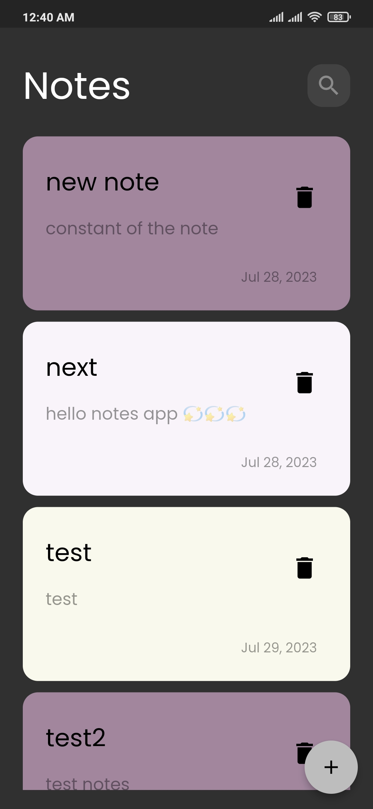
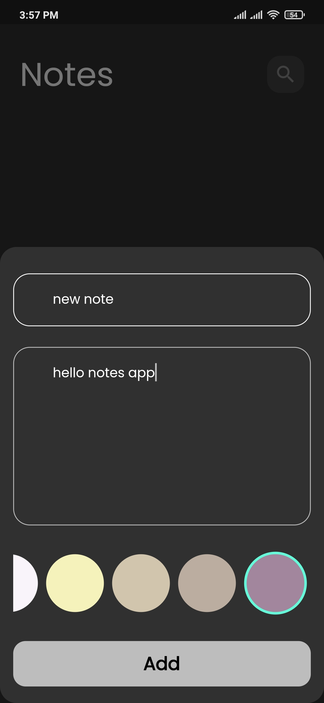
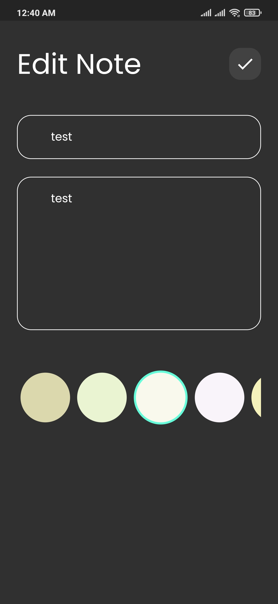

# Notes_App

 

<h3 align="center">Notes App</h3>

  

    Notes App using Hive as a local Datebase and using Bloc as a state management.
     
    <a href="https://github.com/shehab-nabil/Notes_app"><strong>Explore the docs »</strong></a>
     
     
  

Notes App is open-source  app for Android & ios. It is built with Dart on top of Google's Flutter Framework.

     

<b>Notes</b>

- [🖥] # Screens 🖥
- [🆗] HomeScreen
- [🆗] Add Note Bottom Sheet 
- [🆗] Edit Note Screen
--------------------------------
- [🖥] # Deal With 🖥
- [x] Deal With Hive DB
- [x] Deal With Bloc State Management
- [x] Deal With Design Pattern 

------------------------------

## Snapshots

| Home Screen| 
|---------------------------------------------|
|---------------------------------------------|
|

| Add Note|           
|---------------------------------------------|
|---------------------------------------------|
|  

|Edit Note| 
|---------------------------------------------|
|---------------------------------------------|
| 

